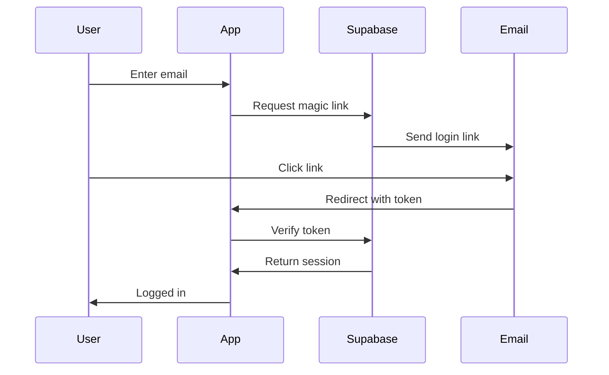

# Charity Prep - Technical Architecture

## Table of Contents

1. [Architecture Overview](https://claude.ai/chat/fc3a6c79-43ff-4f26-9e96-5f711b996cd9#architecture-overview)
2. [Core Technology Stack](https://claude.ai/chat/fc3a6c79-43ff-4f26-9e96-5f711b996cd9#core-technology-stack)
3. [System Architecture](https://claude.ai/chat/fc3a6c79-43ff-4f26-9e96-5f711b996cd9#system-architecture)
4. [Database Architecture](https://claude.ai/chat/fc3a6c79-43ff-4f26-9e96-5f711b996cd9#database-architecture)
5. [API Design](https://claude.ai/chat/fc3a6c79-43ff-4f26-9e96-5f711b996cd9#api-design)
6. [Authentication & Authorization](https://claude.ai/chat/fc3a6c79-43ff-4f26-9e96-5f711b996cd9#authentication--authorization)
7. [AI/LLM Integration](https://claude.ai/chat/fc3a6c79-43ff-4f26-9e96-5f711b996cd9#aillm-integration)
8. [File Processing Pipeline](https://claude.ai/chat/fc3a6c79-43ff-4f26-9e96-5f711b996cd9#file-processing-pipeline)
9. [Email System Architecture](https://claude.ai/chat/fc3a6c79-43ff-4f26-9e96-5f711b996cd9#email-system-architecture)
10. [Payment Processing](https://claude.ai/chat/fc3a6c79-43ff-4f26-9e96-5f711b996cd9#payment-processing)
11. [Security Architecture](https://claude.ai/chat/fc3a6c79-43ff-4f26-9e96-5f711b996cd9#security-architecture)
12. [Infrastructure & Deployment](https://claude.ai/chat/fc3a6c79-43ff-4f26-9e96-5f711b996cd9#infrastructure--deployment)
13. [Performance & Scalability](https://claude.ai/chat/fc3a6c79-43ff-4f26-9e96-5f711b996cd9#performance--scalability)
14. [Development Practices](https://claude.ai/chat/fc3a6c79-43ff-4f26-9e96-5f711b996cd9#development-practices)

## Architecture Overview

### Design Principles

1. **API-First**: All functionality exposed through well-defined APIs
2. **Real-time First**: Live updates for compliance scores and collaboration
3. **Mobile-First**: Progressive enhancement from mobile up
4. **Type-Safe**: End-to-end TypeScript for reliability
5. **Edge-Optimized**: Leverage edge computing for performance
6. **AI-Native**: LLM integration as core, not bolt-on

### High-Level Architecture

```
┌─────────────────┐     ┌─────────────────┐     ┌─────────────────┐
│                 │     │                 │     │                 │
│  Web App (PWA)  │     │  Mobile (PWA)   │     │ Advisor Portal  │
│   (Next.js)     │     │   (Next.js)     │     │   (Next.js)     │
│                 │     │                 │     │                 │
└────────┬────────┘     └────────┬────────┘     └────────┬────────┘
         │                       │                         │
         └───────────────────────┴─────────────────────────┘
                                 │
                    ┌────────────▼────────────┐
                    │                         │
                    │   Next.js API Routes    │
                    │   + Edge Functions      │
                    │                         │
                    └────┬──────────────┬─────┘
                         │              │
              ┌──────────▼───┐    ┌─────▼──────────┐
              │              │    │                │
              │   Supabase   │    │  AI Services   │
              │              │    │                │
              └──────────────┘    └────────────────┘

```

## Core Technology Stack

### Frontend

- **Framework**: Next.js 14 (App Router)
- **Language**: TypeScript 5.x (strict mode)
- **UI Library**: Shadcn UI (Radix + Tailwind)
- **State Management**: Zustand 4.x
- **Forms**: React Hook Form + Zod
- **Data Fetching**: TanStack Query v5
- **Real-time**: Supabase Realtime
- **Charts**: Recharts / Tremor
- **PDF Generation**: React PDF
- **Testing**: Playwright + Jest

### Backend

- **Database**: Supabase (PostgreSQL 15)
- **Auth**: Supabase Auth (passwordless)
- **Storage**: Supabase Storage
- **API**: Next.js API Routes
- **Edge Functions**: Vercel Edge Functions
- **Background Jobs**: Vercel Cron
- **Email**: Resend
- **Payments**: Stripe

### AI/ML Stack

- **LLM Primary**: Gemini 2.5 Flash via Openrouter
- **Embeddings**: OpenAI text-embedding-3-small
- **Vector DB**: Supabase pgvector
- **OCR**: GPT-4 Vision API
- **Document Processing**: LangChain

### Infrastructure

- **Hosting**: Vercel (London region)
- **CDN**: Vercel Edge Network
- **Monitoring**: Vercel Analytics + Sentry
- **Logging**: Axiom
- **Domain/SSL**: Vercel

## System Architecture

### Request Flow

```
User Request → Vercel Edge → Next.js Middleware → API Route → Supabase/AI
     ↑                                                              ↓
     └──────────────────── Response ←──────────────────────────────┘

```

### Component Architecture

```tsx
// Feature-based structure
/app
  /(auth)
    /login
    /verify
  /(app)
    /dashboard
    /compliance
      /safeguarding
      /overseas
      /fundraising
    /documents
    /reports
  /(api)
    /api
      /compliance
      /ai
      /documents
      /webhooks

/components
  /ui          // Shadcn components
  /features    // Feature-specific components
  /layouts     // Layout components

/lib
  /api         // API client functions
  /ai          // AI service integrations
  /utils       // Shared utilities
  /hooks       // Custom React hooks
  /stores      // Zustand stores

/services
  /email       // Email service
  /export      // Export generators
  /import      // Import processors

```

## Database Architecture

### Schema Design Philosophy

- **Multi-tenancy**: Row-level security (RLS) on all tables
- **Soft Deletes**: `deleted_at` timestamps, never hard delete
- **Audit Trail**: `created_at`, `updated_at`, `created_by`, `updated_by`
- **UUID Keys**: All primary keys are UUIDs
- **Normalized**: 3NF with strategic denormalization for performance

### Core Tables

```sql
-- Organizations (Charities)
CREATE TABLE organizations (
  id UUID PRIMARY KEY DEFAULT gen_random_uuid(),
  name TEXT NOT NULL,
  charity_number TEXT UNIQUE,
  income_band TEXT CHECK (income_band IN ('small', 'medium', 'large')),
  year_end_date DATE NOT NULL,
  created_at TIMESTAMPTZ DEFAULT NOW(),
  updated_at TIMESTAMPTZ DEFAULT NOW()
);

-- Users
CREATE TABLE users (
  id UUID PRIMARY KEY REFERENCES auth.users(id),
  email TEXT UNIQUE NOT NULL,
  full_name TEXT,
  avatar_url TEXT,
  created_at TIMESTAMPTZ DEFAULT NOW()
);

-- Organization Membership
CREATE TABLE organization_members (
  id UUID PRIMARY KEY DEFAULT gen_random_uuid(),
  organization_id UUID REFERENCES organizations(id),
  user_id UUID REFERENCES users(id),
  role TEXT CHECK (role IN ('admin', 'member', 'viewer')),
  created_at TIMESTAMPTZ DEFAULT NOW(),
  UNIQUE(organization_id, user_id)
);

-- Compliance Modules
CREATE TABLE safeguarding_records (
  id UUID PRIMARY KEY DEFAULT gen_random_uuid(),
  organization_id UUID REFERENCES organizations(id),
  person_name TEXT NOT NULL,
  role TEXT NOT NULL,
  dbs_number TEXT,
  issue_date DATE NOT NULL,
  expiry_date DATE NOT NULL,
  document_id UUID REFERENCES documents(id),
  created_by UUID REFERENCES users(id),
  created_at TIMESTAMPTZ DEFAULT NOW(),
  updated_at TIMESTAMPTZ DEFAULT NOW()
);

CREATE TABLE overseas_activities (
  id UUID PRIMARY KEY DEFAULT gen_random_uuid(),
  organization_id UUID REFERENCES organizations(id),
  country_code TEXT NOT NULL,
  partner_name TEXT,
  activity_type TEXT,
  amount DECIMAL(10,2) NOT NULL,
  transfer_method TEXT NOT NULL,
  financial_year INTEGER NOT NULL,
  created_at TIMESTAMPTZ DEFAULT NOW()
);

-- AI Processing Queue
CREATE TABLE ai_tasks (
  id UUID PRIMARY KEY DEFAULT gen_random_uuid(),
  organization_id UUID REFERENCES organizations(id),
  type TEXT NOT NULL, -- 'ocr', 'import', 'narrative'
  status TEXT DEFAULT 'pending',
  input_data JSONB NOT NULL,
  output_data JSONB,
  error TEXT,
  created_at TIMESTAMPTZ DEFAULT NOW(),
  completed_at TIMESTAMPTZ
);

```

### Indexing Strategy

```sql
-- Performance indexes
CREATE INDEX idx_safeguarding_expiry ON safeguarding_records(organization_id, expiry_date);
CREATE INDEX idx_overseas_year ON overseas_activities(organization_id, financial_year);
CREATE INDEX idx_ai_tasks_status ON ai_tasks(status, created_at);

-- Full-text search
CREATE INDEX idx_documents_search ON documents USING gin(to_tsvector('english', content));

```

### Row-Level Security

```sql
-- Example RLS policies
ALTER TABLE organizations ENABLE ROW LEVEL SECURITY;

CREATE POLICY "Users can view their organizations" ON organizations
  FOR SELECT USING (
    id IN (
      SELECT organization_id FROM organization_members
      WHERE user_id = auth.uid()
    )
  );

CREATE POLICY "Admins can update their organizations" ON organizations
  FOR UPDATE USING (
    id IN (
      SELECT organization_id FROM organization_members
      WHERE user_id = auth.uid() AND role = 'admin'
    )
  );

```

## API Design

### RESTful Endpoints

```tsx
// Compliance endpoints
GET    /api/compliance/safeguarding
POST   /api/compliance/safeguarding
PUT    /api/compliance/safeguarding/:id
DELETE /api/compliance/safeguarding/:id

GET    /api/compliance/overseas
POST   /api/compliance/overseas
PUT    /api/compliance/overseas/:id

GET    /api/compliance/score
GET    /api/compliance/missing

// AI endpoints
POST   /api/ai/extract-document
POST   /api/ai/generate-narrative
POST   /api/ai/suggest-tasks
POST   /api/ai/answer-question

// Import/Export
POST   /api/import/csv
POST   /api/import/email
GET    /api/export/annual-return
GET    /api/export/board-pack

```

### API Response Format

```tsx
interface ApiResponse<T> {
  success: boolean;
  data?: T;
  error?: {
    code: string;
    message: string;
    details?: any;
  };
  meta?: {
    timestamp: string;
    version: string;
    requestId: string;
  };
}

```

### Rate Limiting

```tsx
// middleware/rateLimit.ts
const rateLimits = {
  api: { requests: 100, window: '1m' },
  ai: { requests: 20, window: '1m' },
  export: { requests: 10, window: '5m' },
  import: { requests: 5, window: '1m' }
};

```

## Authentication & Authorization

### Passwordless Flow



### Session Management

```tsx
// lib/auth.ts
export const authOptions = {
  providers: [
    {
      id: 'email',
      type: 'email',
      maxAge: 24 * 60 * 60, // 24 hours
      sendVerificationRequest: async ({ identifier, url }) => {
        await sendEmail({
          to: identifier,
          subject: 'Login to Charity Prep',
          template: 'magic-link',
          props: { url }
        });
      }
    }
  ],
  callbacks: {
    session: async ({ session, user }) => {
      // Attach organization and role
      const membership = await getOrganizationMembership(user.id);
      session.organizationId = membership.organizationId;
      session.role = membership.role;
      return session;
    }
  }
};

```

### Authorization Middleware

```tsx
// middleware/authorize.ts
export function authorize(allowedRoles: Role[]) {
  return async (req: NextRequest) => {
    const session = await getSession(req);

    if (!session) {
      return new Response('Unauthorized', { status: 401 });
    }

    if (!allowedRoles.includes(session.role)) {
      return new Response('Forbidden', { status: 403 });
    }
  };
}

```

## AI/LLM Integration

### Service Architecture

```tsx
// services/ai/index.ts
export class AIService {
  private openai: OpenAI;
  private anthropic: Anthropic;

  async extractDocument(file: File): Promise<ExtractedData> {
    // Use GPT-4 Vision for OCR
    const base64 = await fileToBase64(file);

    const response = await this.openai.chat.completions.create({
      model: "gpt-4-vision-preview",
      messages: [
        {
          role: "system",
          content: "Extract structured data from this charity document..."
        },
        {
          role: "user",
          content: [
            { type: "text", text: "Extract all relevant compliance data" },
            { type: "image_url", image_url: { url: `data:image/jpeg;base64,${base64}` } }
          ]
        }
      ],
      response_format: { type: "json_object" }
    });

    return parseExtractedData(response);
  }

  async generateNarrative(data: ComplianceData): Promise<string> {
    // Use Claude for longer-form generation
    const response = await this.anthropic.messages.create({
      model: "claude-3-opus-20240229",
      messages: [
        {
          role: "system",
          content: "Generate a professional trustee report..."
        },
        {
          role: "user",
          content: JSON.stringify(data)
        }
      ]
    });

    return response.content[0].text;
  }
}

```

### Vector Search for Q&A

```tsx
// services/ai/search.ts
export class ComplianceSearch {
  async indexRegulations() {
    // Embed all regulation text
    const chunks = splitRegulations(CHARITY_REGULATIONS);

    for (const chunk of chunks) {
      const embedding = await createEmbedding(chunk.text);

      await supabase.from('regulation_embeddings').insert({
        content: chunk.text,
        embedding,
        metadata: chunk.metadata
      });
    }
  }

  async answerQuestion(question: string, context: OrgContext) {
    // Get relevant regulation chunks
    const embedding = await createEmbedding(question);

    const { data: relevant } = await supabase.rpc('match_regulations', {
      query_embedding: embedding,
      match_threshold: 0.8,
      match_count: 5
    });

    // Generate answer with context
    const answer = await generateAnswer(question, relevant, context);
    return answer;
  }
}

```

### Prompt Management

```tsx
// lib/ai/prompts.ts
export const PROMPTS = {
  EXTRACT_DBS: `
    Extract the following from this DBS certificate:
    - Full name
    - Certificate number
    - Issue date
    - Role/position

    Return as JSON with these exact keys.
  `,

  GENERATE_BOARD_NARRATIVE: `
    You are writing a compliance section for a charity trustee report.

    Given the following compliance data:
    {data}

    Generate a professional 2-3 paragraph summary that:
    - Highlights compliance achievements
    - Notes any areas needing attention
    - Uses positive, confident language
    - Includes specific metrics where relevant
  `,

  SUGGEST_TASKS: `
    Based on this charity's compliance status:
    {status}

    Suggest 3-5 specific, actionable tasks to improve compliance.
    Priority order by risk and effort.
    Each task should be completable within 1 week.
  `
};

```

## File Processing Pipeline

### Email Ingestion

```tsx
// services/email/ingest.ts
export class EmailIngester {
  async processIncomingEmail(email: ParsedMail) {
    // Extract organization from recipient
    const orgId = extractOrgId(email.to); // data-{orgId}@charityprep.uk

    // Process attachments
    for (const attachment of email.attachments) {
      const file = await uploadToStorage(attachment);

      // Queue for AI processing
      await queueAITask({
        type: 'extract_document',
        organizationId: orgId,
        input: { fileId: file.id }
      });
    }

    // Process email body for data
    if (hasStructuredData(email.text)) {
      await queueAITask({
        type: 'extract_email',
        organizationId: orgId,
        input: { content: email.text }
      });
    }
  }
}

```

### Document Processing Queue

```tsx
// workers/aiProcessor.ts
export async function processAIQueue() {
  const tasks = await getUnprocessedTasks();

  for (const task of tasks) {
    try {
      let result;

      switch (task.type) {
        case 'extract_document':
          result = await extractDocument(task.input);
          break;
        case 'generate_narrative':
          result = await generateNarrative(task.input);
          break;
        case 'import_csv':
          result = await processCSVImport(task.input);
          break;
      }

      await updateTask(task.id, {
        status: 'completed',
        output_data: result,
        completed_at: new Date()
      });

    } catch (error) {
      await updateTask(task.id, {
        status: 'failed',
        error: error.message
      });
    }
  }
}

```

## Email System Architecture

### Transactional Emails

```tsx
// services/email/templates.ts
export const EMAIL_TEMPLATES = {
  MAGIC_LINK: {
    subject: 'Login to Charity Prep',
    template: 'magic-link'
  },
  DBS_EXPIRY_WARNING: {
    subject: 'DBS Check Expiring Soon - Action Required',
    template: 'dbs-expiry'
  },
  WEEKLY_DIGEST: {
    subject: 'Your Weekly Compliance Update',
    template: 'weekly-digest'
  },
  COMPLIANCE_ACHIEVEMENT: {
    subject: '🎉 Compliance Milestone Reached!',
    template: 'achievement'
  }
};

// services/email/send.ts
export async function sendEmail(params: EmailParams) {
  const { data, error } = await resend.emails.send({
    from: 'Charity Prep <noreply@charityprep.uk>',
    to: params.to,
    subject: params.subject,
    react: EmailTemplate(params.template, params.props)
  });

  // Log email sends for compliance
  await logEmailSent(params);

  return { data, error };
}

```

### Email Scheduling

```tsx
// cron/emailScheduler.ts
export async function sendWeeklyDigests() {
  const organizations = await getActiveOrganizations();

  for (const org of organizations) {
    const digest = await generateWeeklyDigest(org.id);

    if (digest.hasUpdates) {
      await sendEmail({
        to: org.adminEmails,
        template: 'weekly-digest',
        props: digest
      });
    }
  }
}

// Vercel cron configuration
// vercel.json
{
  "crons": [{
    "path": "/api/cron/weekly-digest",
    "schedule": "0 9 * * 5" // Fridays at 9am
  }]
}

```

## Payment Processing

### Stripe Integration

```tsx
// services/payments/stripe.ts
export class PaymentService {
  async createCheckoutSession(params: CheckoutParams) {
    const session = await stripe.checkout.sessions.create({
      line_items: [{
        price: PRICE_IDS[params.tier],
        quantity: 1
      }],
      metadata: {
        organizationId: params.organizationId,
        userId: params.userId
      },
      success_url: `${BASE_URL}/payment/success?session_id={CHECKOUT_SESSION_ID}`,
      cancel_url: `${BASE_URL}/payment/cancel`,
      customer_email: params.email,
      client_reference_id: params.organizationId,
      subscription_data: {
        metadata: {
          charityName: params.charityName,
          charityNumber: params.charityNumber
        }
      }
    });

    return session;
  }

  async handleWebhook(event: Stripe.Event) {
    switch (event.type) {
      case 'customer.subscription.created':
        await activateSubscription(event.data.object);
        break;
      case 'customer.subscription.updated':
        await updateSubscription(event.data.object);
        break;
      case 'customer.subscription.deleted':
        await handleCancellation(event.data.object);
        break;
    }
  }
}

```

### Subscription Management

```tsx
// lib/subscriptions.ts
export async function enforceSubscriptionLimits(orgId: string) {
  const subscription = await getSubscription(orgId);
  const usage = await getUsage(orgId);

  const limits = {
    essentials: { users: 2, storage: 100 * 1024 * 1024 }, // 100MB
    standard: { users: 5, storage: 1024 * 1024 * 1024 }, // 1GB
    premium: { users: 20, storage: 10 * 1024 * 1024 * 1024 } // 10GB
  };

  if (usage.users > limits[subscription.tier].users) {
    throw new UpgradeRequiredError('User limit exceeded');
  }
}

```

## Security Architecture

### Security Measures

1. **Data Encryption**
    - At rest: AES-256 via Supabase
    - In transit: TLS 1.3
    - Sensitive fields: Additional application-level encryption
2. **Access Control**
    - Row-level security on all tables
    - Role-based permissions (admin/member/viewer)
    - API key rotation for services
3. **Compliance**
    - GDPR compliant data handling
    - UK data residency (Vercel London region)
    - Audit logging for all data access
    - Right to deletion implementation
4. **Security Headers**

    ```tsx
    // middleware.ts
    export function middleware(request: NextRequest) {
      const headers = new Headers(request.headers);

      headers.set('X-Frame-Options', 'DENY');
      headers.set('X-Content-Type-Options', 'nosniff');
      headers.set('X-XSS-Protection', '1; mode=block');
      headers.set('Referrer-Policy', 'strict-origin-when-cross-origin');
      headers.set('Permissions-Policy', 'camera=(), microphone=(), geolocation=()');

      return NextResponse.next({ headers });
    }

    ```


### Input Validation

```tsx
// lib/validation.ts
export const schemas = {
  safeguardingRecord: z.object({
    personName: z.string().min(2).max(100),
    role: z.string().min(2).max(50),
    dbsNumber: z.string().regex(/^\d{12}$/),
    issueDate: z.date().max(new Date()),
    expiryDate: z.date().min(new Date())
  }),

  overseasActivity: z.object({
    countryCode: z.string().length(2),
    partnerName: z.string().optional(),
    amount: z.number().positive().max(1000000000),
    transferMethod: z.enum(['bank', 'crypto', 'cash', 'moneygram'])
  })
};

```

## Infrastructure & Deployment

### Environment Configuration

```bash
# .env.local
NEXT_PUBLIC_SUPABASE_URL=https://xxx.supabase.co
NEXT_PUBLIC_SUPABASE_ANON_KEY=xxx
SUPABASE_SERVICE_KEY=xxx
OPENAI_API_KEY=sk-xxx
ANTHROPIC_API_KEY=sk-ant-xxx
STRIPE_SECRET_KEY=sk_xxx
STRIPE_WEBHOOK_SECRET=whsec_xxx
RESEND_API_KEY=re_xxx
SENTRY_DSN=https://xxx@sentry.io/xxx

```

### CI/CD Pipeline

```yaml
# .github/workflows/deploy.yml
name: Deploy
on:
  push:
    branches: [main]

jobs:
  test:
    runs-on: ubuntu-latest
    steps:
      - uses: actions/checkout@v3
      - uses: actions/setup-node@v3
      - run: npm ci
      - run: npm run test:e2e

  deploy:
    needs: test
    runs-on: ubuntu-latest
    steps:
      - uses: actions/checkout@v3
      - uses: vercel/action@v23
        with:
          vercel-token: ${{ secrets.VERCEL_TOKEN }}
          vercel-org-id: ${{ secrets.ORG_ID }}
          vercel-project-id: ${{ secrets.PROJECT_ID }}

```

### Monitoring & Observability

```tsx
// lib/monitoring.ts
export function initMonitoring() {
  // Sentry for error tracking
  Sentry.init({
    dsn: process.env.SENTRY_DSN,
    tracesSampleRate: 0.1,
    profilesSampleRate: 0.1,
  });

  // Custom metrics
  track('api_request', {
    endpoint: request.url,
    method: request.method,
    duration: responseTime,
    status: response.status
  });

  // Business metrics
  track('compliance_score_calculated', {
    organizationId,
    score,
    modules: completedModules
  });
}

```

## Performance & Scalability

### Performance Optimizations

1. **Database**
    - Indexed all foreign keys and common queries
    - Materialized views for compliance scores
    - Connection pooling via Supabase
2. **Caching Strategy**
    - Static assets: Vercel Edge Cache
    - API responses: Redis via Upstash
    - Compliance scores: 5-minute cache
    - LLM responses: 24-hour cache for identical queries
3. **Code Splitting**

    ```tsx
    // Dynamic imports for heavy components
    const PDFGenerator = dynamic(() => import('@/components/PDFGenerator'), {
      loading: () => <Skeleton />,
      ssr: false
    });

    ```

4. **Image Optimization**

    ```tsx
    // Automatic optimization via Next.js
    <Image
      src={document.url}
      alt={document.name}
      width={800}
      height={600}
      placeholder="blur"
      blurDataURL={document.blurHash}
    />

    ```


### Scalability Plan

**Phase 1 (0-1k users)**

- Single Vercel deployment
- Supabase free tier
- Basic monitoring

**Phase 2 (1k-10k users)**

- Vercel Pro with autoscaling
- Supabase Pro tier
- Redis caching layer
- Dedicated AI rate limits

**Phase 3 (10k+ users)**

- Multi-region deployment
- Read replicas for database
- Dedicated AI infrastructure
- Enterprise support tiers

## Development Practices

### Code Standards

```tsx
// .eslintrc.js
module.exports = {
  extends: [
    'next/core-web-vitals',
    'plugin:@typescript-eslint/recommended'
  ],
  rules: {
    '@typescript-eslint/explicit-function-return-type': 'error',
    '@typescript-eslint/no-explicit-any': 'error',
    'no-console': ['error', { allow: ['warn', 'error'] }]
  }
};

```

### Testing Strategy

```tsx
// E2E Critical Paths
describe('Compliance Flow', () => {
  test('User can complete safeguarding module', async ({ page }) => {
    await page.goto('/compliance/safeguarding');
    await page.fill('[name="personName"]', 'John Smith');
    await page.fill('[name="dbsNumber"]', '123456789012');
    await page.click('button[type="submit"]');
    await expect(page.locator('.success-message')).toBeVisible();
  });
});

// Unit tests for business logic
describe('Compliance Score', () => {
  test('calculates correct score', () => {
    const score = calculateComplianceScore({
      safeguarding: { complete: 8, total: 10 },
      overseas: { complete: 5, total: 5 },
      fundraising: { complete: 3, total: 5 }
    });
    expect(score).toBe(80); // 16/20 = 80%
  });
});

```

### Documentation

- **API Documentation**: OpenAPI 3.0 spec
- **Component Storybook**: For UI components
- **Architecture Decision Records**: In `/docs/adr`
- **Runbooks**: For common operations

## Summary

This architecture provides a solid foundation for rapid development while maintaining quality and scalability. The use of modern tooling (Next.js 14, Supabase, Vercel) combined with AI-first design enables us to build sophisticated features quickly. The focus on type safety, real-time updates, and mobile-first design ensures a great user experience, while the security and compliance measures protect sensitive charity data.