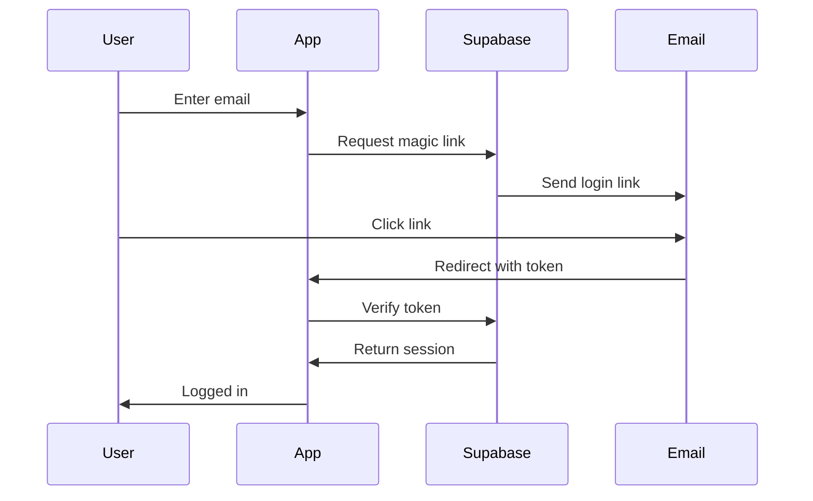

# NextJS Best Practices & Architecture Guide

## Table of Contents

1. [Architecture Overview](#architecture-overview)
2. [Core Technology Stack](#core-technology-stack)
3. [Project Structure](#project-structure)
4. [Development Principles](#development-principles)
5. [Server Components & Actions](#server-components--actions)
6. [State Management with Zustand](#state-management-with-zustand)
7. [Data Fetching & Caching](#data-fetching--caching)
8. [Component Architecture](#component-architecture)
9. [AI/LLM Integration](#aillm-integration)
10. [Performance Optimizations](#performance-optimizations)
11. [Security Architecture](#security-architecture)
12. [Testing Strategy](#testing-strategy)
13. [Development Workflow](#development-workflow)
14. [Deployment & Infrastructure](#deployment--infrastructure)
15. [Monitoring & Observability](#monitoring--observability)
16. [Design System](#design-system)
17. [Best Practices Summary](#best-practices-summary)

## Architecture Overview

### Design Principles

1. **API-First**: All functionality exposed through well-defined APIs
2. **Real-time First**: Live updates for compliance scores and collaboration
3. **Mobile-First**: Progressive enhancement from mobile up
4. **Type-Safe**: End-to-end TypeScript for reliability
5. **Edge-Optimized**: Leverage edge computing for performance
6. **AI-Native**: LLM integration as core, not bolt-on
7. **Server-First**: Use Server Components by default, Client Components only when needed
8. **Feature-Based Organization**: Group code by business domain, not technical layers
9. **Data on Server**: Fetch data in Server Components, use Zustand only for UI state
10. **Progressive Enhancement**: Works without JavaScript, enhanced with interactivity

### High-Level Architecture

```
┌─────────────────┐     ┌─────────────────┐     ┌─────────────────┐
│                 │     │                 │     │                 │
│  Web App (PWA)  │     │  Mobile (PWA)   │     │ Advisor Portal  │
│   (Next.js)     │     │   (Next.js)     │     │   (Next.js)     │
│                 │     │                 │     │                 │
└────────┬────────┘     └────────┬────────┘     └────────┬────────┘
         │                       │                         │
         └───────────────────────┴─────────────────────────┘
                                 │
                    ┌────────────▼────────────┐
                    │                         │
                    │   Next.js API Routes    │
                    │   + Edge Functions      │
                    │                         │
                    └────┬──────────────┬─────┘
                         │              │
              ┌──────────▼───┐    ┌─────▼──────────┐
              │              │    │                │
              │   Supabase   │    │  AI Services   │
              │              │    │                │
              └──────────────┘    └────────────────┘
```

### Request Flow

```
User Request → Vercel Edge → Next.js Middleware → API Route → Supabase/AI
     ↑                                                              ↓
     └──────────────────── Response ←──────────────────────────────┘
```

## Core Technology Stack

### Frontend
- **Framework**: Next.js 15.2 (App Router)
- **Language**: TypeScript 5.x (strict mode)
- **UI Library**: Shadcn UI (Radix + Tailwind)
- **State Management**: Zustand 4.x (UI state only)
- **Forms**: React Hook Form + Zod
- **Data Fetching**: Server Components + Server Actions
- **Caching**: Next.js Data Cache + Request Memoization
- **Real-time**: Supabase Realtime
- **Charts**: Recharts / Tremor
- **PDF Generation**: React PDF
- **Testing**: Playwright + Jest

### Backend
- **Database**: Supabase (PostgreSQL 15)
- **Auth**: Supabase Auth (passwordless)
- **Storage**: Supabase Storage
- **API**: Next.js API Routes
- **Edge Functions**: Vercel Edge Functions
- **Background Jobs**: Vercel Cron
- **Email**: Resend
- **Payments**: Stripe

### AI/ML Stack
- **LLM Primary**: Gemini 2.5 Flash via Openrouter
- **Embeddings**: OpenAI text-embedding-3-small
- **Vector DB**: Supabase pgvector
- **OCR**: GPT-4 Vision API
- **Document Processing**: LangChain

### Infrastructure
- **Hosting**: Vercel (London region)
- **CDN**: Vercel Edge Network
- **Monitoring**: Vercel Analytics + Sentry
- **Logging**: Axiom
- **Domain/SSL**: Vercel

## Project Structure

### Root Directory Structure

```
charity-prep/
├── app/                          # Next.js 15.2 App Router
├── features/                     # Feature modules (main business logic)
│   ├── auth/
│   ├── compliance/
│   ├── ai/
│   ├── documents/
│   └── reports/
├── components/                   # Shared UI components
│   ├── ui/                       # Shadcn UI components
│   ├── custom-ui/                # Ethereal-specific components
│   ├── layout/                   # Layout components
│   └── common/                   # Common components
├── stores/                       # Global Zustand stores (minimal)
├── lib/                          # Core utilities
├── types/                        # Global TypeScript types
├── hooks/                        # Global custom hooks
├── services/                     # External service integrations
├── supabase/                     # Database migrations & types
├── tests/                        # Test files
└── config/                       # Configuration files
```

### Feature Module Structure

Each feature follows this pattern:

```
features/compliance/
├── components/               # UI components
│   ├── dbs-table.tsx        # Server Component
│   ├── dbs-form.tsx         # Client Component
│   └── expiry-badge.tsx     # Server Component
├── actions/                  # Server Actions
│   ├── safeguarding.ts      # 'use server' functions
│   └── compliance-score.ts
├── services/                 # API/Supabase calls
│   ├── safeguarding.ts      # Data fetching
│   └── compliance.ts
├── stores/                   # Feature-specific Zustand
│   └── safeguarding-store.ts
├── hooks/                    # Custom hooks
│   ├── use-dbs-records.ts
│   └── use-compliance.ts
├── types/                    # TypeScript types
│   ├── safeguarding.ts
│   └── compliance.ts
└── utils/                    # Feature utilities
    ├── dbs-validation.ts
    └── expiry-calculation.ts
```

### App Router Structure

```
app/
├── (auth)/                   # Auth layout group
│   ├── login/
│   │   └── page.tsx         # Magic link login
│   ├── verify/
│   │   └── page.tsx         # Email verification
│   └── layout.tsx           # Minimal auth layout
│
├── (app)/                    # Main app layout group
│   ├── layout.tsx           # Sidebar + main layout
│   ├── dashboard/
│   │   └── page.tsx         # Main dashboard
│   ├── compliance/
│   │   ├── page.tsx         # Compliance overview
│   │   ├── safeguarding/
│   │   ├── overseas/
│   │   └── fundraising/
│   ├── documents/
│   ├── reports/
│   └── settings/
│
├── api/                      # API routes
│   ├── auth/
│   ├── compliance/
│   ├── ai/
│   ├── import/
│   ├── webhooks/
│   └── cron/
│
├── layout.tsx                # Root layout
├── page.tsx                  # Landing page
├── loading.tsx               # Global loading
├── error.tsx                 # Global error
└── not-found.tsx            # 404 page
```

## Development Principles

### Core Principles from CLAUDE.md

1. **Always read entire files** - Otherwise, you don't know what you don't know, and will end up making mistakes, duplicating code that already exists, or misunderstanding the architecture.

2. **Ask before editing Tailwind config** - You should ask to edit tailwindcss config and related files before editing. Otherwise strictly do not edit the config.

3. **Commit early and often** - When working on large tasks, your task could be broken down into multiple logical milestones. After a certain milestone is completed and confirmed to be ok by the user, you should commit it.

4. **Keep library knowledge up to date** - Your internal knowledgebase of libraries might not be up to date. When working with any external library, unless you are 100% sure that the library has a super stable interface, you will look up the latest syntax and usage.

5. **Don't skip failing libraries** - Do not say things like: "x library isn't working so I will skip it". Generally, it isn't working because you are using the incorrect syntax or patterns.

6. **Always run linting** - Always run linting after making major changes. Otherwise, you won't know if you've corrupted a file or made syntax errors.

7. **Organize code properly** - Please organise code into separate files wherever appropriate, and follow general coding best practices about variable naming, modularity, function complexity, file sizes, commenting, etc.

8. **Optimize for readability** - Code is read more often than it is written, make sure your code is always optimised for readability.

9. **No dummy implementations** - Unless explicitly asked otherwise, the user never wants you to do a "dummy" implementation of any given task. Just implement the thing.

10. **Clarity before starting** - Whenever you are starting a new task, it is of utmost importance that you have clarity about the task. You should ask the user follow up questions if you do not.

11. **No large refactors without permission** - Do not carry out large refactors unless explicitly instructed to do so.

12. **Plan before coding** - When starting on a new task, you should first understand the current architecture, identify the files you will need to modify, and come up with a Plan.

13. **Find root causes** - If you are running into repeated issues with a given task, figure out the root cause instead of throwing random things at the wall.

### Component Architecture Principles

1. **Separation of Concerns**: Separate base UI components from custom themed components
2. **Server Components by Default**: Only use 'use client' when needed
3. **Server Actions for Mutations**: Handle forms and data updates
4. **Zustand for UI State**: Keep client state minimal
5. **Parallel Data Fetching**: Use Promise.all() for performance
6. **Streaming with Suspense**: Progressive page loading
7. **Type Everything**: Use TypeScript and Zod for safety
8. **Cache Aggressively**: Use Next.js caching features

## Server Components & Actions

### Decision Framework

```
Is user interaction required?
├─ NO → Server Component (default)
│   └─ Examples: Data display, static content, layouts
├─ YES → Is it form input or real-time updates?
    ├─ Form → Server Component + Server Action
    │   └─ Examples: Create/edit forms
    └─ Real-time → Client Component
        └─ Examples: Charts, live updates, modals
```

### Server Component Patterns

```typescript
// app/(app)/dashboard/page.tsx - Server Component (default)
import { DashboardStats } from '@/features/compliance/components/dashboard-stats'
import { RecentActivity } from '@/features/compliance/components/recent-activity'
import { createServerClient } from '@/lib/supabase/server'

export default async function DashboardPage() {
  // Fetch data on the server
  const supabase = createServerClient()
  const { data: stats } = await supabase
    .from('compliance_scores')
    .select('*')
    .single()

  return (
    <div className="space-y-6">
      {/* Pass server data to components */}
      <DashboardStats initialStats={stats} />
      
      {/* Suspense for streaming */}
      <Suspense fallback={<ActivitySkeleton />}>
        <RecentActivity />
      </Suspense>
    </div>
  )
}
```

### Client Component Patterns

```typescript
// features/compliance/components/compliance-score.tsx
'use client'

import { useComplianceStore } from '@/features/compliance/stores/compliance-store'
import { useEffect } from 'react'

interface ComplianceScoreProps {
  initialScore: number
}

export function ComplianceScore({ initialScore }: ComplianceScoreProps) {
  const { score, setScore } = useComplianceStore()
  
  // Hydrate client store with server data
  useEffect(() => {
    setScore(initialScore)
  }, [initialScore, setScore])
  
  return (
    <div className="relative">
      {/* Interactive UI */}
      <CircularProgress value={score} />
    </div>
  )
}
```

### Server Actions Pattern

```typescript
// features/compliance/actions/safeguarding.ts
'use server'

import { revalidatePath, revalidateTag } from 'next/cache'
import { createServerClient } from '@/lib/supabase/server'
import { SafeguardingRecordSchema } from '../types/safeguarding'
import { ActionResponse } from '@/types/global'

export async function createDBSRecord(
  formData: FormData
): Promise<ActionResponse<SafeguardingRecord>> {
  try {
    // Parse and validate with Zod
    const rawData = Object.fromEntries(formData.entries())
    const validated = SafeguardingRecordSchema.parse(rawData)
    
    // Get authenticated client
    const supabase = createServerClient()
    const { data: { user } } = await supabase.auth.getUser()
    
    if (!user) {
      return { success: false, error: 'Unauthorized' }
    }
    
    // Create record
    const { data, error } = await supabase
      .from('safeguarding_records')
      .insert({
        ...validated,
        created_by: user.id,
      })
      .select()
      .single()
    
    if (error) throw error
    
    // Revalidate cache
    revalidateTag('safeguarding')
    revalidatePath('/compliance/safeguarding')
    
    return { success: true, data }
  } catch (error) {
    console.error('Failed to create DBS record:', error)
    
    if (error.name === 'ZodError') {
      return { 
        success: false, 
        error: 'Validation failed',
        fieldErrors: error.flatten().fieldErrors 
      }
    }
    
    return { 
      success: false, 
      error: error.message || 'Failed to create record' 
    }
  }
}
```

### Progressive Enhancement Forms

```typescript
// features/compliance/components/dbs-form.tsx
'use client'

import { useTransition } from 'react'
import { useRouter } from 'next/navigation'
import { createDBSRecord } from '../actions/safeguarding'
import { toast } from 'sonner'

export function DBSForm() {
  const [isPending, startTransition] = useTransition()
  const router = useRouter()
  
  async function handleSubmit(formData: FormData) {
    startTransition(async () => {
      const result = await createDBSRecord(formData)
      
      if (result.success) {
        toast.success('DBS record created')
        router.refresh() // Refresh server data
        // Don't update Zustand - let server be source of truth
      } else {
        toast.error(result.error)
        // Show field errors
        if (result.fieldErrors) {
          Object.entries(result.fieldErrors).forEach(([field, errors]) => {
            toast.error(`${field}: ${errors.join(', ')}`)
          })
        }
      }
    })
  }
  
  return (
    <form action={handleSubmit} className="space-y-4">
      <input
        name="person_name"
        required
        className="input"
        placeholder="Person Name"
      />
      
      <input
        name="dbs_number"
        pattern="^\d{12}$"
        required
        className="input"
        placeholder="DBS Number (12 digits)"
      />
      
      <button 
        type="submit" 
        disabled={isPending}
        className="btn-primary"
      >
        {isPending ? 'Creating...' : 'Create DBS Record'}
      </button>
    </form>
  )
}
```

## State Management with Zustand

### Important: Zustand is for UI State, Not Server Data

```typescript
// ❌ BAD: Storing server data in Zustand
const useStore = create((set) => ({
  users: [],        // Don't store server data
  posts: [],        // Fetch in Server Components instead
  fetchUsers: async () => { ... }  // Don't fetch in client
}))

// ✅ GOOD: UI state only
const useUIStore = create((set) => ({
  sidebarOpen: false,
  selectedTab: 'overview',
  modals: { createItem: false },
  toggleSidebar: () => set((state) => ({ sidebarOpen: !state.sidebarOpen }))
}))
```

### Global Store (Minimal)

```typescript
// stores/auth-store.ts
import { create } from 'zustand'
import { devtools, persist } from 'zustand/middleware'
import { immer } from 'zustand/middleware/immer'

interface AuthState {
  user: User | null
  organization: Organization | null
  setUser: (user: User | null) => void
  setOrganization: (org: Organization | null) => void
}

export const useAuthStore = create<AuthState>()(
  devtools(
    persist(
      immer((set) => ({
        user: null,
        organization: null,
        
        setUser: (user) => set((state) => {
          state.user = user
        }),
        
        setOrganization: (org) => set((state) => {
          state.organization = org
        }),
      })),
      {
        name: 'charity-prep-auth',
        partialize: (state) => ({ 
          user: state.user,
          organization: state.organization 
        }),
      }
    )
  )
)
```

### Feature Store (UI State Only)

```typescript
// features/compliance/stores/safeguarding-store.ts
import { create } from 'zustand'
import { immer } from 'zustand/middleware/immer'

interface SafeguardingUIState {
  // UI state only - no server data
  selectedRecordId: string | null
  isFormOpen: boolean
  filters: {
    status: 'all' | 'valid' | 'expiring' | 'expired'
    search: string
  }
  
  // Actions
  selectRecord: (id: string | null) => void
  toggleForm: (open?: boolean) => void
  setFilter: (key: string, value: any) => void
}

export const useSafeguardingStore = create<SafeguardingUIState>()(
  immer((set) => ({
    selectedRecordId: null,
    isFormOpen: false,
    filters: {
      status: 'all',
      search: '',
    },
    
    selectRecord: (id) => set((state) => {
      state.selectedRecordId = id
    }),
    
    toggleForm: (open) => set((state) => {
      state.isFormOpen = open ?? !state.isFormOpen
    }),
    
    setFilter: (key, value) => set((state) => {
      state.filters[key] = value
    }),
  }))
)
```

## Data Fetching & Caching

### NextJS 15 Caching Layers

1. **Request Memoization with `cache()`** - Deduplicates within single request
2. **Data Cache with `unstable_cache()`** - Persists across requests
3. **Full Route Cache** - Static optimization
4. **Automatic fetch() caching** - Configurable strategies

### Optimized Supabase Client with Request Memoization

```typescript
// lib/supabase/server.ts
import { createServerClient as createClient } from '@supabase/ssr'
import { cookies } from 'next/headers'
import { cache } from 'react'

// Memoize client creation to reuse within same request
export const createServerClient = cache(async () => {
  const cookieStore = await cookies()
  
  return createClient(
    process.env.NEXT_PUBLIC_SUPABASE_URL!,
    process.env.NEXT_PUBLIC_SUPABASE_ANON_KEY!,
    {
      cookies: {
        getAll() {
          return cookieStore.getAll()
        },
        setAll(cookiesToSet) {
          cookiesToSet.forEach(({ name, value, options }) =>
            cookieStore.set(name, value, options)
          )
        },
      },
    }
  )
})
```

### Caching Strategies

```typescript
// features/compliance/services/safeguarding.ts
import { createServerClient } from '@/lib/supabase/server'
import { unstable_cache } from 'next/cache'
import { cache } from 'react'

// Request Memoization - Deduplicates within single request
export const getCurrentUser = cache(async () => {
  const supabase = await createServerClient()
  const { data: { user } } = await supabase.auth.getUser()
  return user
})

// Direct server-side data fetching (no caching)
export async function getSafeguardingRecords() {
  const supabase = await createServerClient()
  
  const { data, error } = await supabase
    .from('safeguarding_records')
    .select('*')
    .order('expiry_date', { ascending: true })
  
  if (error) throw error
  return data
}

// Data Cache - Persists across requests
export const getCachedSafeguardingRecords = unstable_cache(
  async (orgId: string) => {
    const supabase = await createServerClient()
    
    const { data, error } = await supabase
      .from('safeguarding_records')
      .select('*')
      .eq('organization_id', orgId)
      .order('expiry_date', { ascending: true })
    
    if (error) throw error
    return data
  },
  ['safeguarding-records'],
  {
    revalidate: 300, // 5 minutes
    tags: ['safeguarding'],
  }
)

// Cached compliance score with granular invalidation
export const getCachedComplianceScore = unstable_cache(
  async (orgId: string) => {
    const supabase = await createServerClient()
    
    const { data } = await supabase
      .from('compliance_scores')
      .select('*')
      .eq('organization_id', orgId)
      .single()
    
    return data
  },
  ['compliance-score'],
  {
    revalidate: 300, // 5 minutes
    tags: ['compliance'],
  }
)
```

### Streaming with Suspense

```typescript
// app/(app)/dashboard/page.tsx
export default async function DashboardPage() {
  // Critical data - await immediately
  const user = await getCurrentUser()
  const org = await getCachedOrganization(user.organizationId)
  
  // Non-critical - don't await (stream)
  const scorePromise = getCachedComplianceScore(org.id)
  const recordsPromise = getCachedSafeguardingRecords(org.id)
  const activitiesPromise = getOverseasActivities(org.id)
  
  return (
    <div className="space-y-6">
      {/* Critical content renders immediately */}
      <ComplianceHeader user={user} organization={org} />
      
      {/* Stream compliance score */}
      <Suspense fallback={<ScoreSkeleton />}>
        <ComplianceScoreCard scorePromise={scorePromise} />
      </Suspense>
      
      {/* Stream safeguarding records */}
      <Suspense fallback={<TableSkeleton />}>
        <SafeguardingTable recordsPromise={recordsPromise} />
      </Suspense>
      
      {/* Stream overseas activities */}
      <Suspense fallback={<TableSkeleton />}>
        <OverseasActivitiesTable activitiesPromise={activitiesPromise} />
      </Suspense>
    </div>
  )
}

// Components that handle promises
async function ComplianceScoreCard({ scorePromise }: { scorePromise: Promise<Score> }) {
  const score = await scorePromise
  return <ComplianceScore data={score} />
}
```

### Route Segment Configuration

```typescript
// app/(app)/dashboard/page.tsx
// Configure how this route behaves
export const revalidate = 60 // Revalidate every minute
export const dynamic = 'force-dynamic' // Always render fresh

// app/(app)/help/page.tsx
// Static content
export const revalidate = 3600 // 1 hour
export const dynamic = 'force-static' // Build-time generation

// app/(app)/reports/annual-return/page.tsx
// On-demand generation
export const dynamic = 'force-dynamic'
export const runtime = 'nodejs' // Use Node.js runtime for PDF generation
```

### Parallel Data Loading

```typescript
// app/(app)/dashboard/page.tsx
export default async function DashboardPage() {
  // Load all data in parallel
  const [stats, activities, notifications] = await Promise.all([
    getComplianceStats(),
    getRecentActivities(), 
    getActiveNotifications(),
  ])
  
  return (
    <>
      <StatsGrid data={stats} />
      <ActivityFeed data={activities} />
      <NotificationBell count={notifications.length} />
    </>
  )
}
```

## Component Architecture

### Separation of Concerns

To maintain a clean and maintainable codebase, we separate base UI components from custom themed components:

#### Base Components (`/components/ui/`)
- Standard Shadcn UI components
- Use CSS variables for theming
- Can be updated via `npx shadcn@latest` without losing customizations
- Examples: `button.tsx`, `card.tsx`, `input.tsx`

#### Custom Ethereal Components (`/components/custom-ui/`)
- Ethereal-specific styled components
- Hardcoded brand colors and styling
- Named with `ethereal-` prefix
- Examples: `ethereal-button.tsx`, `ethereal-card.tsx`

### Usage Pattern

```tsx
// For standard UI elements that follow the theme
import { Button } from '@/components/ui/button'

// For brand-specific elements with Ethereal styling
import { EtherealButton } from '@/components/custom-ui/ethereal-button'

// Example usage
<Button variant="default">Standard Button</Button>
<EtherealButton variant="primary">Brand Button</EtherealButton>
```

### Custom Component Guidelines

1. **Naming Convention**: Always prefix with `ethereal-`
2. **Color Values**: Use hardcoded hex values, not CSS variables
3. **Variants**: Create brand-specific variants (primary, secondary, tertiary)
4. **Animations**: Include Ethereal-specific transitions and hover states
5. **Documentation**: Comment on when to use custom vs base components

### Real-time Component Patterns

```typescript
// features/compliance/hooks/use-realtime-compliance.ts
'use client'

import { useEffect } from 'react'
import { createBrowserClient } from '@/lib/supabase/client'
import { useRouter } from 'next/navigation'

export function useRealtimeCompliance() {
  const router = useRouter()
  const supabase = createBrowserClient()
  
  useEffect(() => {
    const channel = supabase
      .channel('compliance-changes')
      .on(
        'postgres_changes',
        {
          event: '*',
          schema: 'public',
          table: 'safeguarding_records',
        },
        () => {
          // Refresh server data
          router.refresh()
        }
      )
      .subscribe()
    
    return () => {
      supabase.removeChannel(channel)
    }
  }, [router, supabase])
}
```

## AI/LLM Integration

### Service Architecture

```tsx
// services/ai/index.ts
export class AIService {
  private openai: OpenAI;
  private anthropic: Anthropic;

  async extractDocument(file: File): Promise<ExtractedData> {
    // Use GPT-4 Vision for OCR
    const base64 = await fileToBase64(file);

    const response = await this.openai.chat.completions.create({
      model: "gpt-4-vision-preview",
      messages: [
        {
          role: "system",
          content: "Extract structured data from this charity document..."
        },
        {
          role: "user",
          content: [
            { type: "text", text: "Extract all relevant compliance data" },
            { type: "image_url", image_url: { url: `data:image/jpeg;base64,${base64}` } }
          ]
        }
      ],
      response_format: { type: "json_object" }
    });

    return parseExtractedData(response);
  }

  async generateNarrative(data: ComplianceData): Promise<string> {
    // Use Claude for longer-form generation
    const response = await this.anthropic.messages.create({
      model: "claude-3-opus-20240229",
      messages: [
        {
          role: "system",
          content: "Generate a professional trustee report..."
        },
        {
          role: "user",
          content: JSON.stringify(data)
        }
      ]
    });

    return response.content[0].text;
  }
}
```

### Vector Search for Q&A

```tsx
// services/ai/search.ts
export class ComplianceSearch {
  async indexRegulations() {
    // Embed all regulation text
    const chunks = splitRegulations(CHARITY_REGULATIONS);

    for (const chunk of chunks) {
      const embedding = await createEmbedding(chunk.text);

      await supabase.from('regulation_embeddings').insert({
        content: chunk.text,
        embedding,
        metadata: chunk.metadata
      });
    }
  }

  async answerQuestion(question: string, context: OrgContext) {
    // Get relevant regulation chunks
    const embedding = await createEmbedding(question);

    const { data: relevant } = await supabase.rpc('match_regulations', {
      query_embedding: embedding,
      match_threshold: 0.8,
      match_count: 5
    });

    // Generate answer with context
    const answer = await generateAnswer(question, relevant, context);
    return answer;
  }
}
```

### Prompt Management

```tsx
// lib/ai/prompts.ts
export const PROMPTS = {
  EXTRACT_DBS: `
    Extract the following from this DBS certificate:
    - Full name
    - Certificate number
    - Issue date
    - Role/position

    Return as JSON with these exact keys.
  `,

  GENERATE_BOARD_NARRATIVE: `
    You are writing a compliance section for a charity trustee report.

    Given the following compliance data:
    {data}

    Generate a professional 2-3 paragraph summary that:
    - Highlights compliance achievements
    - Notes any areas needing attention
    - Uses positive, confident language
    - Includes specific metrics where relevant
  `,

  SUGGEST_TASKS: `
    Based on this charity's compliance status:
    {status}

    Suggest 3-5 specific, actionable tasks to improve compliance.
    Priority order by risk and effort.
    Each task should be completable within 1 week.
  `
};
```

### Streaming AI Responses

```typescript
// features/ai/components/compliance-chat.tsx
'use client'

import { useChat } from 'ai/react'

export function ComplianceChat() {
  const { messages, input, handleInputChange, handleSubmit, isLoading } = useChat({
    api: '/api/ai/chat',
    initialMessages: [
      {
        id: '1',
        role: 'assistant',
        content: 'Hi! I can help answer your compliance questions.',
      },
    ],
  })
  
  return (
    <div className="flex flex-col h-full">
      <div className="flex-1 overflow-y-auto">
        {messages.map((message) => (
          <ChatMessage key={message.id} message={message} />
        ))}
      </div>
      
      <form onSubmit={handleSubmit} className="border-t p-4">
        <input
          value={input}
          onChange={handleInputChange}
          placeholder="Ask about compliance..."
          disabled={isLoading}
        />
      </form>
    </div>
  )
}
```

### Document Processing

```typescript
// features/ai/actions/document-extraction.ts
'use server'

import { createServerClient } from '@/lib/supabase/server'
import { extractWithAI } from '@/lib/ai/extraction'

export async function processDocument(
  documentId: string
): Promise<ActionResponse<ExtractedData>> {
  const supabase = createServerClient()
  
  // Get document from storage
  const { data: document } = await supabase
    .from('documents')
    .select('*')
    .eq('id', documentId)
    .single()
  
  // Queue AI processing
  const { data: task } = await supabase
    .from('ai_tasks')
    .insert({
      type: 'document_extraction',
      status: 'pending',
      input_data: { documentId },
    })
    .select()
    .single()
  
  // Process in background (could use Queue/Job system)
  processInBackground(task.id)
  
  return { 
    success: true, 
    data: { taskId: task.id, status: 'processing' } 
  }
}
```

## Performance Optimizations

### 1. Code Splitting & Lazy Loading

#### Dynamic Imports
- **Chart Components**: All heavy charting libraries (recharts) are dynamically imported
- **PDF Generation**: PDF libraries loaded only when needed
- **CSV Processing**: Papa Parse loaded on-demand
- **Rich Text Editors**: Editor components loaded when accessed

```typescript
// Dashboard page now uses dynamic imports
const ComplianceTrendChart = dynamic(
  () => import('@/features/dashboard/components/compliance-trend-chart'),
  { loading: () => <ChartSkeleton />, ssr: false }
)
```

### 2. Image Optimization

#### Next.js Image Component
- Automatic format conversion (WebP, AVIF)
- Responsive image sizing
- Lazy loading with blur placeholders
- Optimized caching headers

#### Components Created
- `OptimizedImage`: Enhanced Next.js Image with error handling
- `LazyImage`: Intersection Observer-based lazy loading
- `ProgressiveImage`: Low quality to high quality loading
- `ResponsiveImage`: Art direction for different viewports

### 3. Bundle Optimization

#### Next.js Configuration
- Vendor chunk splitting
- Common module extraction
- Tree shaking for unused code
- CSS optimization enabled
- Package import optimization for lucide-react, radix-ui, recharts

```typescript
// Heavy components
import dynamic from 'next/dynamic'

const PDFGenerator = dynamic(
  () => import('@/features/reports/components/PDFGenerator'),
  {
    loading: () => <div>Preparing PDF generator...</div>,
    ssr: false, // Don't render on server
  }
)

const ChartComponents = dynamic(
  () => import('@/features/analytics/components/Charts'),
  {
    loading: () => <ChartSkeleton />,
  }
)

// Use in component
export function ReportPage() {
  const [showPDF, setShowPDF] = useState(false)
  
  return (
    <>
      <button onClick={() => setShowPDF(true)}>Generate PDF</button>
      {showPDF && <PDFGenerator />} {/* Only loads when needed */}
    </>
  )
}
```

### 4. Data Virtualization

#### Virtual Table Component
- Only renders visible rows
- Smooth scrolling for large datasets
- Search and sort without full re-render
- Optimized for 10,000+ rows

```typescript
<VirtualTable
  data={records}
  columns={columns}
  visibleRows={10}
  rowHeight={52}
/>
```

### 5. Search & Input Optimization

#### Debounced Components
- `DebouncedInput`: Prevents excessive API calls
- `useDebounce` hook for values
- `useDebouncedCallback` for functions
- `useThrottle` for high-frequency updates

### 6. Loading States & Suspense

#### Skeleton Components
- `KPICardsSkeleton`
- `ChartSkeleton`
- `TableSkeleton`
- `FormSkeleton`
- `ActivityFeedSkeleton`

### 7. Optimistic UI with Server Actions

```typescript
// features/compliance/components/dbs-quick-actions.tsx
'use client'

import { useState, useOptimistic } from 'react'
import { deleteDBSRecord } from '../actions/safeguarding'

export function DBSQuickActions({ records }: { records: DBSRecord[] }) {
  const [optimisticRecords, addOptimisticUpdate] = useOptimistic(
    records,
    (state, { type, id }) => {
      if (type === 'delete') {
        return state.filter(record => record.id !== id)
      }
      return state
    }
  )
  
  async function handleDelete(id: string) {
    // Optimistic update
    addOptimisticUpdate({ type: 'delete', id })
    
    // Server action
    const result = await deleteDBSRecord(id)
    
    if (!result.success) {
      toast.error('Failed to delete record')
      // Router refresh will restore the original state
    }
  }
  
  return (
    <div>
      {optimisticRecords.map(record => (
        <RecordCard 
          key={record.id} 
          record={record}
          onDelete={() => handleDelete(record.id)}
        />
      ))}
    </div>
  )
}
```

### Performance Metrics

#### Target Metrics
- **LCP**: < 2.5s (good), < 4s (needs improvement)
- **FID**: < 100ms (good), < 300ms (needs improvement)
- **CLS**: < 0.1 (good), < 0.25 (needs improvement)
- **TTFB**: < 800ms
- **Bundle Size**: < 500KB initial JS

## Security Architecture

### Security Measures

1. **Data Encryption**
    - At rest: AES-256 via Supabase
    - In transit: TLS 1.3
    - Sensitive fields: Additional application-level encryption

2. **Access Control**
    - Row-level security on all tables
    - Role-based permissions (admin/member/viewer)
    - API key rotation for services

3. **Compliance**
    - GDPR compliant data handling
    - UK data residency (Vercel London region)
    - Audit logging for all data access
    - Right to deletion implementation

4. **Security Headers**

```tsx
// middleware.ts
export function middleware(request: NextRequest) {
  const headers = new Headers(request.headers);

  headers.set('X-Frame-Options', 'DENY');
  headers.set('X-Content-Type-Options', 'nosniff');
  headers.set('X-XSS-Protection', '1; mode=block');
  headers.set('Referrer-Policy', 'strict-origin-when-cross-origin');
  headers.set('Permissions-Policy', 'camera=(), microphone=(), geolocation=()');

  return NextResponse.next({ headers });
}
```

### Input Validation

```tsx
// lib/validation.ts
export const schemas = {
  safeguardingRecord: z.object({
    personName: z.string().min(2).max(100),
    role: z.string().min(2).max(50),
    dbsNumber: z.string().regex(/^\d{12}$/),
    issueDate: z.date().max(new Date()),
    expiryDate: z.date().min(new Date())
  }),

  overseasActivity: z.object({
    countryCode: z.string().length(2),
    partnerName: z.string().optional(),
    amount: z.number().positive().max(1000000000),
    transferMethod: z.enum(['bank', 'crypto', 'cash', 'moneygram'])
  })
};
```

### Authentication & Authorization

#### Passwordless Flow



#### Session Management

```tsx
// lib/auth.ts
export const authOptions = {
  providers: [
    {
      id: 'email',
      type: 'email',
      maxAge: 24 * 60 * 60, // 24 hours
      sendVerificationRequest: async ({ identifier, url }) => {
        await sendEmail({
          to: identifier,
          subject: 'Login to Charity Prep',
          template: 'magic-link',
          props: { url }
        });
      }
    }
  ],
  callbacks: {
    session: async ({ session, user }) => {
      // Attach organization and role
      const membership = await getOrganizationMembership(user.id);
      session.organizationId = membership.organizationId;
      session.role = membership.role;
      return session;
    }
  }
};
```

#### Authorization Middleware

```tsx
// middleware/authorize.ts
export function authorize(allowedRoles: Role[]) {
  return async (req: NextRequest) => {
    const session = await getSession(req);

    if (!session) {
      return new Response('Unauthorized', { status: 401 });
    }

    if (!allowedRoles.includes(session.role)) {
      return new Response('Forbidden', { status: 403 });
    }
  };
}
```

### Server Actions Security

```typescript
// Always validate user permissions in server actions
export async function deleteDBSRecord(id: string) {
  const supabase = createServerClient()
  const { data: { user } } = await supabase.auth.getUser()
  
  if (!user) {
    return { success: false, error: 'Unauthorized' }
  }
  
  // Check user has permission for this organization
  const { data: member } = await supabase
    .from('organization_members')
    .select('role')
    .eq('user_id', user.id)
    .single()
  
  if (!member || member.role === 'viewer') {
    return { success: false, error: 'Insufficient permissions' }
  }
  
  // Proceed with deletion
}
```

### Client State Security

```typescript
// Never store sensitive data in Zustand
// ❌ Bad
const useStore = create((set) => ({
  apiKey: 'secret-key', // Never do this
}))

// ✅ Good
const useStore = create((set) => ({
  isAuthenticated: false, // Only store UI state
}))
```

## Testing Strategy

### Overview

Simple, pragmatic testing that doesn't slow down our 5-day build:

- **Unit Tests**: Business logic and utilities (Jest)
- **Integration Tests**: API routes and database operations (Jest + Supabase)
- **E2E Tests**: Critical user paths (Playwright)
- **Skip**: Testing UI components, external APIs, generated code

### When to Write Tests

**ALWAYS test:**
- Business logic (compliance calculations, date logic)
- Data transformations (CSV parsing, report generation)
- API endpoints (especially auth-protected routes)
- Critical user journeys (signup → first value)

**SKIP testing:**
- Shadcn UI components (already tested)
- Simple CRUD without logic
- Third-party integrations (mock instead)
- Generated TypeScript types

### Example: Unit Test

```tsx
// lib/compliance/__tests__/score-calculator.test.ts

import { calculateComplianceScore } from '../score-calculator';

describe('calculateComplianceScore', () => {
  it('calculates 100% when all modules complete', () => {
    const data = {
      safeguarding: { complete: 10, total: 10 },
      overseas: { complete: 5, total: 5 },
      fundraising: { complete: 8, total: 8 },
    };

    expect(calculateComplianceScore(data)).toBe(100);
  });

  it('weights modules correctly (40% safeguarding, 30% overseas, 30% fundraising)', () => {
    const data = {
      safeguarding: { complete: 10, total: 10 }, // 100% * 0.4 = 40
      overseas: { complete: 0, total: 5 },        // 0% * 0.3 = 0
      fundraising: { complete: 4, total: 8 },     // 50% * 0.3 = 15
    };

    expect(calculateComplianceScore(data)).toBe(55);
  });

  it('handles empty data gracefully', () => {
    const data = {
      safeguarding: { complete: 0, total: 0 },
      overseas: { complete: 0, total: 0 },
      fundraising: { complete: 0, total: 0 },
    };

    expect(calculateComplianceScore(data)).toBe(0);
  });
});
```

### Example: API Test

```tsx
// app/api/compliance/safeguarding/__tests__/route.test.ts

import { createClient } from '@supabase/supabase-js';
import { POST, GET } from '../route';

// Mock Supabase
jest.mock('@supabase/supabase-js');

describe('Safeguarding API', () => {
  let mockSupabase;

  beforeEach(() => {
    mockSupabase = {
      from: jest.fn(() => ({
        select: jest.fn(() => ({
          eq: jest.fn(() => ({
            data: [createMockDBS()],
            error: null,
          })),
        })),
        insert: jest.fn(() => ({
          select: jest.fn(() => ({
            single: jest.fn(() => ({
              data: createMockDBS(),
              error: null,
            })),
          })),
        })),
      })),
    };

    createClient.mockReturnValue(mockSupabase);
  });

  describe('GET /api/compliance/safeguarding', () => {
    it('returns safeguarding records for organization', async () => {
      const request = new Request('http://localhost/api/compliance/safeguarding', {
        headers: {
          'organization-id': '456',
        },
      });

      const response = await GET(request);
      const data = await response.json();

      expect(response.status).toBe(200);
      expect(data).toHaveLength(1);
      expect(data[0].person_name).toBe('John Smith');
    });

    it('returns 401 without organization header', async () => {
      const request = new Request('http://localhost/api/compliance/safeguarding');
      const response = await GET(request);

      expect(response.status).toBe(401);
    });
  });
});
```

### Example: E2E Test

```tsx
// tests/e2e/onboarding.spec.ts

import { test, expect } from '@playwright/test';

test.describe('Onboarding Flow', () => {
  test('new user can sign up and see compliance issues', async ({ page }) => {
    // 1. Start at landing page
    await page.goto('/');

    // 2. Click start trial
    await page.click('text=Start 30-Day Free Trial');

    // 3. Enter email
    await page.fill('input[type="email"]', 'test@charity.org');
    await page.click('text=Send Magic Link');

    // 4. Simulate clicking magic link (in dev, auto-login)
    await page.goto('/auth/callback?token=test-token');

    // 5. Complete setup
    await expect(page).toHaveURL('/onboarding');
    await page.fill('input[name="charity_number"]', '1234567');
    await page.selectOption('select[name="year_end_month"]', '3'); // March
    await page.click('text=Continue');

    // 6. See compliance dashboard
    await expect(page).toHaveURL('/dashboard');
    await expect(page.locator('[data-test="compliance-score"]')).toBeVisible();
    await expect(page.locator('[data-test="compliance-score"]')).toContainText('%');

    // 7. Verify urgent actions shown
    const urgentActions = page.locator('[data-test="urgent-actions"]');
    await expect(urgentActions).toBeVisible();
  });
});
```

### Testing Best Practices

1. **Test Data Isolation**

```tsx
// tests/utils/test-db.ts
export async function createTestOrganization(name: string) {
  const testOrg = {
    id: `test-org-${Date.now()}`,
    name: `Test ${name}`,
    charity_number: `TEST${Date.now()}`,
    // ... other fields
  };

  // Always cleanup in afterAll
  return testOrg;
}
```

2. **Mock External Services**

```tsx
// tests/mocks/ai-service.ts
export const mockAIService = {
  extractDocument: jest.fn().mockResolvedValue({
    person_name: 'Extracted Name',
    dbs_number: '123456789012',
    issue_date: '2025-01-01',
    expiry_date: '2026-01-01',
  }),

  generateNarrative: jest.fn().mockResolvedValue(
    'This charity has maintained excellent compliance...'
  ),
};

// In tests
jest.mock('@/services/ai', () => mockAIService);
```

3. **Use Data Attributes for E2E**

```tsx
// In components
<div data-test="compliance-score">{score}%</div>

// In tests
await page.locator('[data-test="compliance-score"]')
```

### Test Coverage Goals

#### Minimum Coverage (for 5-day build)
- **Business Logic**: 90% coverage
- **API Routes**: 80% coverage
- **Overall**: 60% coverage

#### What to Test on Each Day
- **Day 1**: Auth flows (E2E)
- **Day 2**: Compliance calculations (Unit)
- **Day 3**: AI extraction/generation (Integration)
- **Day 4**: Report generation (E2E)
- **Day 5**: Critical paths (E2E)

## Development Workflow

### Build Order (5-Day Plan)

#### Day 1: Foundation
- `/app/(auth)` - Authentication
- `/app/(app)/layout.tsx` - Main layout
- `/lib/supabase` - Database setup
- `/components/ui` - Shadcn setup

#### Day 2: Core Features
- `/features/compliance/*` - All modules
- `/app/(app)/compliance/*` - Pages
- `/store/*` - State management

#### Day 3: AI Features
- `/features/ai` - Import/generation
- `/services/ai` - AI integrations
- `/app/api/ai/*` - AI endpoints

#### Day 4: Reports & Export
- `/features/reports` - Generators
- `/app/api/export` - Export endpoints
- `/services/export` - PDF/CSV

#### Day 5: Polish & Deploy
- `/app/api/webhooks` - Stripe
- `/app/api/cron` - Scheduled jobs
- Error handling
- Production deployment

### Parallel Development Strategy

#### Day 1 Assignments

**Developer 1: Foundation**
- `/app` structure
- `/components/ui` setup
- `/lib/supabase` integration
- Authentication flow

**Developer 2: Core Features**
- `/features/compliance`
- Database schema
- Basic CRUD operations

**Developer 3: AI & Import**
- `/features/ai`
- `/services/ai`
- Import flows

#### Module Boundaries

Each feature module is self-contained:
- Own components
- Own hooks
- Own utilities
- Own types

This allows AI to work on one module without affecting others.

### File Naming Conventions

#### Components
- **PascalCase**: `ComplianceScore.tsx`
- **Suffix with type**: `DBSForm.tsx`, `UserTable.tsx`
- **Index files**: For clean imports `index.ts`

#### Utilities & Hooks
- **kebab-case**: `date-utils.ts`, `api-client.ts`
- **Hook prefix**: `useAuth.ts`, `useCompliance.ts`

#### API Routes
- **Folder-based**: `/api/compliance/score/route.ts`
- **RESTful naming**: Not `/api/getScore`

#### Types
- **PascalCase interfaces**: `interface ComplianceData {}`
- **lowercase types**: `type ApiResponse<T> = {}`
- **UPPER_CASE enums**: `enum COMPLIANCE_STATUS {}`

### Import Organization

```tsx
// 1. React/Next
import { useState, useEffect } from 'react'
import { useRouter } from 'next/navigation'

// 2. External libraries
import { format } from 'date-fns'
import { z } from 'zod'

// 3. Internal absolute imports
import { Button } from '@/components/ui/button'
import { useAuth } from '@/features/auth/hooks/useAuth'
import { api } from '@/lib/api/client'

// 4. Relative imports
import { ComplianceScore } from './ComplianceScore'

// 5. Types
import type { ComplianceData } from '@/types'
```

### Quick Start Commands

```bash
# Clone and setup
git clone [repo]
cd charity-prep
npm install

# Generate types from Supabase
npm run generate:types

# Development
npm run dev         # Start dev server
npm run dev:email   # Email webhook tunnel
npm run studio      # Supabase Studio

# Testing
npm run test:e2e    # Playwright tests
npm run test:unit   # Jest tests

# Production
npm run build       # Production build
npm run start       # Start production
```

## Deployment & Infrastructure

### Environment Configuration

```bash
# .env.local
NEXT_PUBLIC_SUPABASE_URL=https://xxx.supabase.co
NEXT_PUBLIC_SUPABASE_ANON_KEY=xxx
SUPABASE_SERVICE_KEY=xxx
OPENAI_API_KEY=sk-xxx
ANTHROPIC_API_KEY=sk-ant-xxx
STRIPE_SECRET_KEY=sk_xxx
STRIPE_WEBHOOK_SECRET=whsec_xxx
RESEND_API_KEY=re_xxx
SENTRY_DSN=https://xxx@sentry.io/xxx
```

### CI/CD Pipeline

```yaml
# .github/workflows/deploy.yml
name: Deploy
on:
  push:
    branches: [main]

jobs:
  test:
    runs-on: ubuntu-latest
    steps:
      - uses: actions/checkout@v3
      - uses: actions/setup-node@v3
      - run: npm ci
      - run: npm run test:e2e

  deploy:
    needs: test
    runs-on: ubuntu-latest
    steps:
      - uses: actions/checkout@v3
      - uses: vercel/action@v23
        with:
          vercel-token: ${{ secrets.VERCEL_TOKEN }}
          vercel-org-id: ${{ secrets.ORG_ID }}
          vercel-project-id: ${{ secrets.PROJECT_ID }}
```

### Scalability Plan

**Phase 1 (0-1k users)**
- Single Vercel deployment
- Supabase free tier
- Basic monitoring

**Phase 2 (1k-10k users)**
- Vercel Pro with autoscaling
- Supabase Pro tier
- Redis caching layer
- Dedicated AI rate limits

**Phase 3 (10k+ users)**
- Multi-region deployment
- Read replicas for database
- Dedicated AI infrastructure
- Enterprise support tiers

### Database Architecture

#### Schema Design Philosophy
- **Multi-tenancy**: Row-level security (RLS) on all tables
- **Soft Deletes**: `deleted_at` timestamps, never hard delete
- **Audit Trail**: `created_at`, `updated_at`, `created_by`, `updated_by`
- **UUID Keys**: All primary keys are UUIDs
- **Normalized**: 3NF with strategic denormalization for performance

#### Core Tables

```sql
-- Organizations (Charities)
CREATE TABLE organizations (
  id UUID PRIMARY KEY DEFAULT gen_random_uuid(),
  name TEXT NOT NULL,
  charity_number TEXT UNIQUE,
  income_band TEXT CHECK (income_band IN ('small', 'medium', 'large')),
  year_end_date DATE NOT NULL,
  created_at TIMESTAMPTZ DEFAULT NOW(),
  updated_at TIMESTAMPTZ DEFAULT NOW()
);

-- Users
CREATE TABLE users (
  id UUID PRIMARY KEY REFERENCES auth.users(id),
  email TEXT UNIQUE NOT NULL,
  full_name TEXT,
  avatar_url TEXT,
  created_at TIMESTAMPTZ DEFAULT NOW()
);

-- Organization Membership
CREATE TABLE organization_members (
  id UUID PRIMARY KEY DEFAULT gen_random_uuid(),
  organization_id UUID REFERENCES organizations(id),
  user_id UUID REFERENCES users(id),
  role TEXT CHECK (role IN ('admin', 'member', 'viewer')),
  created_at TIMESTAMPTZ DEFAULT NOW(),
  UNIQUE(organization_id, user_id)
);

-- Compliance Modules
CREATE TABLE safeguarding_records (
  id UUID PRIMARY KEY DEFAULT gen_random_uuid(),
  organization_id UUID REFERENCES organizations(id),
  person_name TEXT NOT NULL,
  role TEXT NOT NULL,
  dbs_number TEXT,
  issue_date DATE NOT NULL,
  expiry_date DATE NOT NULL,
  document_id UUID REFERENCES documents(id),
  created_by UUID REFERENCES users(id),
  created_at TIMESTAMPTZ DEFAULT NOW(),
  updated_at TIMESTAMPTZ DEFAULT NOW()
);

CREATE TABLE overseas_activities (
  id UUID PRIMARY KEY DEFAULT gen_random_uuid(),
  organization_id UUID REFERENCES organizations(id),
  country_code TEXT NOT NULL,
  partner_name TEXT,
  activity_type TEXT,
  amount DECIMAL(10,2) NOT NULL,
  transfer_method TEXT NOT NULL,
  financial_year INTEGER NOT NULL,
  created_at TIMESTAMPTZ DEFAULT NOW()
);

-- AI Processing Queue
CREATE TABLE ai_tasks (
  id UUID PRIMARY KEY DEFAULT gen_random_uuid(),
  organization_id UUID REFERENCES organizations(id),
  type TEXT NOT NULL, -- 'ocr', 'import', 'narrative'
  status TEXT DEFAULT 'pending',
  input_data JSONB NOT NULL,
  output_data JSONB,
  error TEXT,
  created_at TIMESTAMPTZ DEFAULT NOW(),
  completed_at TIMESTAMPTZ
);
```

#### Indexing Strategy

```sql
-- Performance indexes
CREATE INDEX idx_safeguarding_expiry ON safeguarding_records(organization_id, expiry_date);
CREATE INDEX idx_overseas_year ON overseas_activities(organization_id, financial_year);
CREATE INDEX idx_ai_tasks_status ON ai_tasks(status, created_at);

-- Full-text search
CREATE INDEX idx_documents_search ON documents USING gin(to_tsvector('english', content));
```

#### Row-Level Security

```sql
-- Example RLS policies
ALTER TABLE organizations ENABLE ROW LEVEL SECURITY;

CREATE POLICY "Users can view their organizations" ON organizations
  FOR SELECT USING (
    id IN (
      SELECT organization_id FROM organization_members
      WHERE user_id = auth.uid()
    )
  );

CREATE POLICY "Admins can update their organizations" ON organizations
  FOR UPDATE USING (
    id IN (
      SELECT organization_id FROM organization_members
      WHERE user_id = auth.uid() AND role = 'admin'
    )
  );
```

### API Design

#### RESTful Endpoints

```tsx
// Compliance endpoints
GET    /api/compliance/safeguarding
POST   /api/compliance/safeguarding
PUT    /api/compliance/safeguarding/:id
DELETE /api/compliance/safeguarding/:id

GET    /api/compliance/overseas
POST   /api/compliance/overseas
PUT    /api/compliance/overseas/:id

GET    /api/compliance/score
GET    /api/compliance/missing

// AI endpoints
POST   /api/ai/extract-document
POST   /api/ai/generate-narrative
POST   /api/ai/suggest-tasks
POST   /api/ai/answer-question

// Import/Export
POST   /api/import/csv
POST   /api/import/email
GET    /api/export/annual-return
GET    /api/export/board-pack
```

#### API Response Format

```tsx
interface ApiResponse<T> {
  success: boolean;
  data?: T;
  error?: {
    code: string;
    message: string;
    details?: any;
  };
  meta?: {
    timestamp: string;
    version: string;
    requestId: string;
  };
}
```

#### Rate Limiting

```tsx
// middleware/rateLimit.ts
const rateLimits = {
  api: { requests: 100, window: '1m' },
  ai: { requests: 20, window: '1m' },
  export: { requests: 10, window: '5m' },
  import: { requests: 5, window: '1m' }
};
```

### Email System Architecture

#### Transactional Emails

```tsx
// services/email/templates.ts
export const EMAIL_TEMPLATES = {
  MAGIC_LINK: {
    subject: 'Login to Charity Prep',
    template: 'magic-link'
  },
  DBS_EXPIRY_WARNING: {
    subject: 'DBS Check Expiring Soon - Action Required',
    template: 'dbs-expiry'
  },
  WEEKLY_DIGEST: {
    subject: 'Your Weekly Compliance Update',
    template: 'weekly-digest'
  },
  COMPLIANCE_ACHIEVEMENT: {
    subject: '🎉 Compliance Milestone Reached!',
    template: 'achievement'
  }
};

// services/email/send.ts
export async function sendEmail(params: EmailParams) {
  const { data, error } = await resend.emails.send({
    from: 'Charity Prep <noreply@charityprep.uk>',
    to: params.to,
    subject: params.subject,
    react: EmailTemplate(params.template, params.props)
  });

  // Log email sends for compliance
  await logEmailSent(params);

  return { data, error };
}
```

#### Email Scheduling

```tsx
// cron/emailScheduler.ts
export async function sendWeeklyDigests() {
  const organizations = await getActiveOrganizations();

  for (const org of organizations) {
    const digest = await generateWeeklyDigest(org.id);

    if (digest.hasUpdates) {
      await sendEmail({
        to: org.adminEmails,
        template: 'weekly-digest',
        props: digest
      });
    }
  }
}

// Vercel cron configuration
// vercel.json
{
  "crons": [{
    "path": "/api/cron/weekly-digest",
    "schedule": "0 9 * * 5" // Fridays at 9am
  }]
}
```

### Payment Processing

#### Stripe Integration

```tsx
// services/payments/stripe.ts
export class PaymentService {
  async createCheckoutSession(params: CheckoutParams) {
    const session = await stripe.checkout.sessions.create({
      line_items: [{
        price: PRICE_IDS[params.tier],
        quantity: 1
      }],
      metadata: {
        organizationId: params.organizationId,
        userId: params.userId
      },
      success_url: `${BASE_URL}/payment/success?session_id={CHECKOUT_SESSION_ID}`,
      cancel_url: `${BASE_URL}/payment/cancel`,
      customer_email: params.email,
      client_reference_id: params.organizationId,
      subscription_data: {
        metadata: {
          charityName: params.charityName,
          charityNumber: params.charityNumber
        }
      }
    });

    return session;
  }

  async handleWebhook(event: Stripe.Event) {
    switch (event.type) {
      case 'customer.subscription.created':
        await activateSubscription(event.data.object);
        break;
      case 'customer.subscription.updated':
        await updateSubscription(event.data.object);
        break;
      case 'customer.subscription.deleted':
        await handleCancellation(event.data.object);
        break;
    }
  }
}
```

#### Subscription Management

```tsx
// lib/subscriptions.ts
export async function enforceSubscriptionLimits(orgId: string) {
  const subscription = await getSubscription(orgId);
  const usage = await getUsage(orgId);

  const limits = {
    essentials: { users: 2, storage: 100 * 1024 * 1024 }, // 100MB
    standard: { users: 5, storage: 1024 * 1024 * 1024 }, // 1GB
    premium: { users: 20, storage: 10 * 1024 * 1024 * 1024 } // 10GB
  };

  if (usage.users > limits[subscription.tier].users) {
    throw new UpgradeRequiredError('User limit exceeded');
  }
}
```

### File Processing Pipeline

#### Email Ingestion

```tsx
// services/email/ingest.ts
export class EmailIngester {
  async processIncomingEmail(email: ParsedMail) {
    // Extract organization from recipient
    const orgId = extractOrgId(email.to); // data-{orgId}@charityprep.uk

    // Process attachments
    for (const attachment of email.attachments) {
      const file = await uploadToStorage(attachment);

      // Queue for AI processing
      await queueAITask({
        type: 'extract_document',
        organizationId: orgId,
        input: { fileId: file.id }
      });
    }

    // Process email body for data
    if (hasStructuredData(email.text)) {
      await queueAITask({
        type: 'extract_email',
        organizationId: orgId,
        input: { content: email.text }
      });
    }
  }
}
```

#### Document Processing Queue

```tsx
// workers/aiProcessor.ts
export async function processAIQueue() {
  const tasks = await getUnprocessedTasks();

  for (const task of tasks) {
    try {
      let result;

      switch (task.type) {
        case 'extract_document':
          result = await extractDocument(task.input);
          break;
        case 'generate_narrative':
          result = await generateNarrative(task.input);
          break;
        case 'import_csv':
          result = await processCSVImport(task.input);
          break;
      }

      await updateTask(task.id, {
        status: 'completed',
        output_data: result,
        completed_at: new Date()
      });

    } catch (error) {
      await updateTask(task.id, {
        status: 'failed',
        error: error.message
      });
    }
  }
}
```

## Monitoring & Observability

```tsx
// lib/monitoring.ts
export function initMonitoring() {
  // Sentry for error tracking
  Sentry.init({
    dsn: process.env.SENTRY_DSN,
    tracesSampleRate: 0.1,
    profilesSampleRate: 0.1,
  });

  // Custom metrics
  track('api_request', {
    endpoint: request.url,
    method: request.method,
    duration: responseTime,
    status: response.status
  });

  // Business metrics
  track('compliance_score_calculated', {
    organizationId,
    score,
    modules: completedModules
  });
}
```

### Client-Side Performance Monitoring

```typescript
// lib/monitoring/client-performance.ts
export function trackCoreWebVitals() {
  if (typeof window === 'undefined') return;

  // First Contentful Paint (FCP)
  const paintObserver = new PerformanceObserver((list) => {
    for (const entry of list.getEntries()) {
      if (entry.name === 'first-contentful-paint') {
        sendMetric('fcp', entry.startTime);
      }
    }
  });
  paintObserver.observe({ entryTypes: ['paint'] });

  // Largest Contentful Paint (LCP)
  const lcpObserver = new PerformanceObserver((list) => {
    const entries = list.getEntries();
    const lastEntry = entries[entries.length - 1];
    sendMetric('lcp', lastEntry.startTime);
  });
  lcpObserver.observe({ entryTypes: ['largest-contentful-paint'] });

  // First Input Delay (FID)
  const fidObserver = new PerformanceObserver((list) => {
    for (const entry of list.getEntries()) {
      sendMetric('fid', entry.processingStart - entry.startTime);
    }
  });
  fidObserver.observe({ entryTypes: ['first-input'] });

  // Cumulative Layout Shift (CLS)
  let clsValue = 0;
  const clsObserver = new PerformanceObserver((list) => {
    for (const entry of list.getEntries()) {
      if (!entry.hadRecentInput) {
        clsValue += entry.value;
      }
    }
  });
  clsObserver.observe({ entryTypes: ['layout-shift'] });

  // Send CLS when page unloads
  window.addEventListener('beforeunload', () => {
    sendMetric('cls', clsValue);
  });
}

function sendMetric(name: string, value: number) {
  // Send to monitoring endpoint
  fetch('/api/monitoring/performance', {
    method: 'POST',
    headers: { 'Content-Type': 'application/json' },
    body: JSON.stringify({
      metric: name,
      value: Math.round(value),
      url: window.location.href,
      timestamp: Date.now(),
    }),
    keepalive: true,
  });
}
```

## Design System

### Ethereal UI — Color Palette

#### Primary Colors

| Color Name | Hex Code | RGB Value | HSL Value | Usage |
| --- | --- | --- | --- | --- |
| Inchworm | #B1FA63 | (177, 250, 99) | 90°, 94%, 68% | Primary accent, interactive elements, CTAs |
| Gunmetal | #243837 | (36, 56, 55) | 177°, 22%, 18% | Primary text, dark mode backgrounds |

#### Secondary Colors

| Color Name | Hex Code | RGB Value | HSL Value | Usage |
| --- | --- | --- | --- | --- |
| Orange | #FE7733 | (254, 119, 51) | 21°, 99%, 60% | Warnings, important notifications, energy |
| Pale Violet | #B2A1FF | (178, 161, 255) | 252°, 100%, 82% | Selected states, subtle interactions |

#### Neutral System

| Color Name | Hex Code | RGB Value | HSL Value | Usage |
| --- | --- | --- | --- | --- |
| Bright Snow | #FFFFFF | (255, 255, 255) | 0°, 0%, 100% | Light mode backgrounds, negative space |
| American Silver | #D1D1D1 | (209, 209, 209) | 0°, 0%, 82% | Subtle UI elements, disabled states |

### Typography

#### Font System

**Primary Font**: Inter
- A versatile neo-grotesque sans-serif with excellent legibility
- Apply -8% letter-spacing globally to achieve a more refined, premium look
- Use SF Pro as fallback for devices without Inter

```css
font-family: 'Inter', 'SF Pro', -apple-system, BlinkMacSystemFont, sans-serif;
letter-spacing: -0.08em;
```

#### Type Scale

| Name | Size | Line Height | Weight | Letter Spacing | Usage |
| --- | --- | --- | --- | --- | --- |
| Display | 48px/3rem | 56px/3.5rem | 700 | -0.08em | Hero content |
| H1 | 40px/2.5rem | 48px/3rem | 700 | -0.08em | Page titles |
| H2 | 32px/2rem | 40px/2.5rem | 600 | -0.08em | Section headers |
| H3 | 24px/1.5rem | 32px/2rem | 600 | -0.08em | Card headers |
| H4 | 20px/1.25rem | 28px/1.75rem | 600 | -0.08em | Subsections |
| H5 | 16px/1rem | 24px/1.5rem | 600 | -0.08em | Minor headers |
| Body | 16px/1rem | 24px/1.5rem | 400 | -0.08em | Main content |
| Small | 14px/0.875rem | 20px/1.25rem | 400 | -0.06em | Secondary info |
| Caption | 12px/0.75rem | 16px/1rem | 400 | -0.04em | Footnotes, captions |
| Button | 14px/0.875rem | 20px/1.25rem | 500 | -0.06em | Interactive text |

### Spacing & Layout

#### Spacing Scale (8px Base Grid)

| Name | Size | Usage |
| --- | --- | --- |
| 3xs | 2px | Minimum spacing (borders) |
| 2xs | 4px | Tight internal spacing |
| xs | 8px | Default component padding |
| sm | 12px | Close element spacing |
| md | 16px | Standard component spacing |
| lg | 24px | Section spacing |
| xl | 32px | Major section spacing |
| 2xl | 48px | Page section divisions |
| 3xl | 64px | Landmark spacing |
| 4xl | 96px | Page-level spacing |

### Component Design

#### Radius System

| Name | Size | Usage |
| --- | --- | --- |
| None | 0 | Flush elements |
| Sm | 4px | Small elements (buttons) |
| Md | 8px | Cards, modals |
| Lg | 12px | Large components |
| Full | 9999px | Pills, indicators |

#### Elevation & Shadows

| Level | Style | Usage |
| --- | --- | --- |
| Surface | none | Background elements |
| Low | `0 1px 2px rgba(36, 56, 55, 0.05)` | Cards, subtle elevation |
| Medium | `0 4px 8px rgba(36, 56, 55, 0.08)` | Popovers, dropdowns |
| High | `0 8px 16px rgba(36, 56, 55, 0.12)` | Modals, dialogs |
| Overlay | `0 16px 32px rgba(36, 56, 55, 0.16)` | Full-screen elements |

#### Button Styles

| Type | Background | Text | Border | Hover State |
| --- | --- | --- | --- | --- |
| Primary | Inchworm | Gunmetal | None | 10% darker |
| Secondary | Transparent | Inchworm | 1px Inchworm | Inchworm 10% opacity |
| Tertiary | Transparent | Gunmetal | None | Grey 200 bg |
| Danger | Orange | White | None | 10% darker |
| Disabled | Grey 300 | Grey 500 | None | No change |

### Motion & Animation

#### Timing

| Speed | Duration | Easing | Usage |
| --- | --- | --- | --- |
| Instant | 100ms | ease-out | Micro-interactions |
| Quick | 200ms | ease-out | Button states |
| Standard | 300ms | ease-in-out | Page transitions |
| Dramatic | 500ms | cubic-bezier(0.19, 1, 0.22, 1) | Feature animations |

#### Principles

- Use subtle motion to enhance usability, not for decoration
- Maintain 60fps performance across all animations
- Elements should move no more than 100px during transitions
- Avoid multiple simultaneous animations that compete for attention

### Implementation Variables

```css
:root {
  /* Color System */
  --color-inchworm: #B1FA63;
  --color-inchworm-dark: #9FE050; /* For hover states */
  --color-gunmetal: #243837;
  --color-orange: #FE7733;
  --color-pale-violet: #B2A1FF;
  --color-white: #FFFFFF;
  --color-silver: #D1D1D1;

  /* Grey Scale */
  --color-grey-100: #F8F8F8;
  --color-grey-200: #EFEFEF;
  --color-grey-300: #E0E0E0;
  --color-grey-400: #BDBDBD;
  --color-grey-500: #9E9E9E;
  --color-grey-600: #757575;
  --color-grey-700: #616161;
  --color-grey-800: #424242;
  --color-grey-900: #212121;

  /* Functional Variables */
  --color-background: var(--color-white);
  --color-surface: var(--color-grey-100);
  --color-text-primary: var(--color-gunmetal);
  --color-text-secondary: var(--color-grey-600);
  --color-accent: var(--color-inchworm);
  --color-warning: var(--color-orange);
  --color-highlight: var(--color-pale-violet);
  --color-border: var(--color-grey-300);

  /* Typography */
  --font-family: 'Inter', 'SF Pro', -apple-system, BlinkMacSystemFont, sans-serif;
  --letter-spacing-tight: -0.08em;
  --letter-spacing-normal: -0.06em;
  --letter-spacing-loose: -0.04em;

  /* Spacing */
  --space-3xs: 2px;
  --space-2xs: 4px;
  --space-xs: 8px;
  --space-sm: 12px;
  --space-md: 16px;
  --space-lg: 24px;
  --space-xl: 32px;
  --space-2xl: 48px;
  --space-3xl: 64px;
  --space-4xl: 96px;

  /* Radius */
  --radius-sm: 4px;
  --radius-md: 8px;
  --radius-lg: 12px;
  --radius-full: 9999px;

  /* Elevation */
  --shadow-low: 0 1px 2px rgba(36, 56, 55, 0.05);
  --shadow-medium: 0 4px 8px rgba(36, 56, 55, 0.08);
  --shadow-high: 0 8px 16px rgba(36, 56, 55, 0.12);
  --shadow-overlay: 0 16px 32px rgba(36, 56, 55, 0.16);

  /* Animation */
  --duration-instant: 100ms;
  --duration-quick: 200ms;
  --duration-standard: 300ms;
  --duration-dramatic: 500ms;
  --ease-standard: ease-in-out;
  --ease-emphasize: cubic-bezier(0.19, 1, 0.22, 1);
}
```

## Best Practices Summary

### Architecture Best Practices

#### Do's ✅

1. **Server Components by default** - Only use 'use client' when needed
2. **Server Actions for mutations** - Progressive enhancement
3. **Zustand for UI state only** - Not for server data
4. **Use Next.js caching** - unstable_cache() and cache() for performance
5. **Parallel data fetching** - Use Promise.all()
6. **Streaming with Suspense** - Better perceived performance
7. **Type everything** - TypeScript + Zod validation
8. **Feature-based organization** - Colocate related code
9. **Configure route segments** - Set revalidate and dynamic options
10. **Memoize expensive operations** - Use React cache() for deduplication
11. **Error boundaries** - Handle failures gracefully
12. **Progressive enhancement** - Forms work without JavaScript

#### Don'ts ❌

1. **Don't fetch in useEffect** - Use Server Components
2. **Don't store server data in Zustand** - Server is source of truth
3. **Don't block on non-critical data** - Use Suspense boundaries
4. **Don't use 'use client' in pages/layouts** - Keep them as Server Components
5. **Don't forget error boundaries** - Handle failures gracefully
6. **Don't create multiple Supabase clients** - Use memoized singleton
7. **Don't put redirect() in try-catch** - Next.js 15 requirement
8. **Don't await non-critical data** - Stream with Suspense instead
9. **Don't over-optimize** - Next.js handles most optimizations
10. **Don't skip testing business logic** - Critical for compliance

### Code Standards

```tsx
// .eslintrc.js
module.exports = {
  extends: [
    'next/core-web-vitals',
    'plugin:@typescript-eslint/recommended'
  ],
  rules: {
    '@typescript-eslint/explicit-function-return-type': 'error',
    '@typescript-eslint/no-explicit-any': 'error',
    'no-console': ['error', { allow: ['warn', 'error'] }]
  }
};
```

### Documentation Standards

- **API Documentation**: OpenAPI 3.0 spec
- **Component Storybook**: For UI components
- **Architecture Decision Records**: In `/docs/adr`
- **Runbooks**: For common operations

## Summary

This architecture provides a solid foundation for rapid development while maintaining quality and scalability. The use of modern tooling (Next.js 15.2, Supabase, Vercel) combined with AI-first design enables us to build sophisticated features quickly. The focus on type safety, real-time updates, and mobile-first design ensures a great user experience, while the security and compliance measures protect sensitive charity data.

### Key Architectural Decisions

1. **Server-First Approach**: Leveraging Next.js 15's Server Components and Server Actions
2. **Smart Caching**: Using Next.js built-in caching instead of custom solutions
3. **Progressive Enhancement**: Forms work without JavaScript
4. **Type Safety**: End-to-end TypeScript with Zod validation
5. **Feature-Based Organization**: Scalable file structure
6. **Minimal Client State**: Zustand only for UI, server is source of truth
7. **AI-Native Design**: LLM integration as core functionality
8. **Performance First**: Streaming, caching, and code splitting by default
9. **Security by Design**: RLS, encryption, and audit trails throughout

The result is a performant, type-safe, and maintainable codebase that delivers excellent user experience while being developer-friendly.